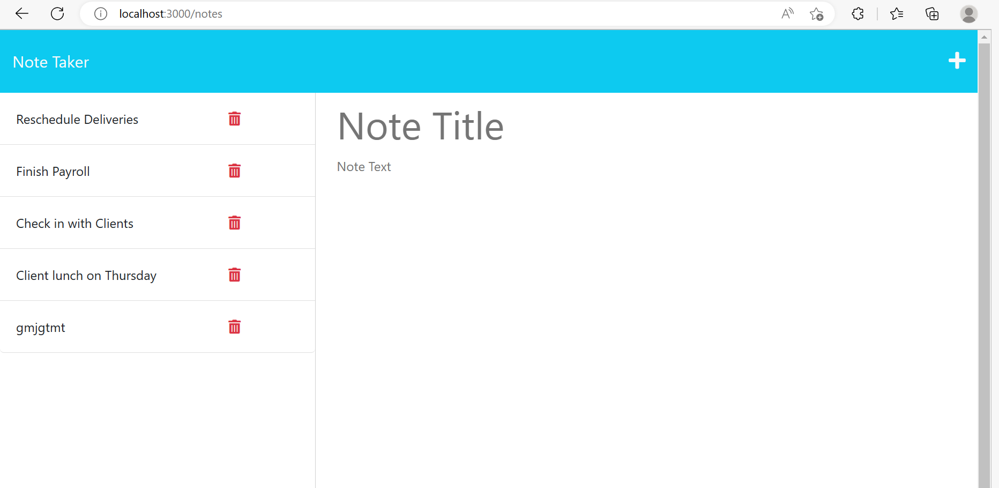

# Note Taker 

## Description
This weeks challenge was to create an application called Note Taker that could be used to write, delete, and view notes.

## Installation and Usage
In order to use this application the user will need to install express. This application was created to allow users to be able to create notes with descriptions as well as view their notes previously made. Lastly it allows the user to delete notes that are no longer needed. 

## Test 
This project can easily be tested if the user run npm run start in the terminal, and clicking the local host link. 

## What I did 
For this project the front-end was already prepared for us so I just had to work on the back end. For this project the first this i created was a notes.json file and I filled it with some notes to start on the page. After that I began working on my server, I gathered all the required things I needed for my code to work, like express and a PORT. After that I made sure that the app knew that I was used express.json as well as using my public folder. After that I started aquiring my notes using the .get method, then I used the .post method to allow the user to make new notes and making sure that it read to the file and then pushed that new note into the notes.json file I had already created. After I completed that I worked on using the .delete method to allow the user to actually delete notes. 

## Screenshots of my page 

